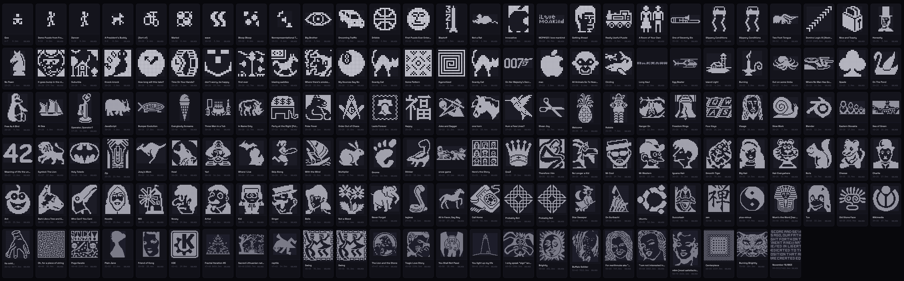

# Nonogram Solver

Fast nonogram solver combining constraint propagation with SAT solving. Solves 159 puzzles including adversarial cases like "Domino Logic" series.



## Approach

**Phase 1: Propagation** (usually enough)
- Line-by-line constraint propagation from [Batenburg & Kosters 2009](https://liacs.leidenuniv.nl/~kosterswa/pbn/icga09.pdf)
- `Settle`: find cells that must be black/white in all valid line placements
- `FullSettle`: iterate until fixpoint
- 2-SAT for global implications (if cell A → cell B across lines)
- Solver0/Solver1: probe undecided cells, propagate consequences

Most puzzles solve here in <100ms.

**Phase 2: SAT** (for adversarial puzzles)

When propagation stalls (zero progress), encode as SAT:

```
Variables: p[r][c] = pixel is black, s[segment][pos] = segment starts at position
Constraints:
  - Each segment starts at exactly one valid position (AMO + ALO)
  - Pixel black ↔ covered by some segment
  - Sequential counter AMO encoding (O(n) clauses, not O(n²) pairwise)
  - Symmetry breaking: if columns are symmetric, force left ≤ right
```

Adaptive solver selection:
- **<100K clauses**: Kissat (fastest single-threaded)
- **≥100K clauses**: CryptoMiniSat with all threads

## Results

```
159/159 puzzles solved (100%)
Hardest: "November 19, 1863" (65x100) - 117s
Most: <100ms via propagation alone
```

## Build

```bash
mkdir build && cd build
cmake .. && make -j
./fast_solver puzzle.non         # single puzzle
./fast_benchmark dir/ out.json   # batch with JSON output
```

## Dependencies

- C++17
- [Kissat](https://github.com/arminbiere/kissat) - SAT solver
- [CryptoMiniSat](https://github.com/msoos/cryptominisat) - parallel SAT solver

## Viewer

```bash
python3 -m http.server 8080
# open http://localhost:8080/viewer.html
```

## References

- Batenburg & Kosters. *A Discrete Tomography Approach to Japanese Puzzles*. ICGA 2009.
- [webpbn.com](https://webpbn.com) - puzzle database
- [nonogram-db](https://github.com/mikix/nonogram-db) - puzzle format spec
